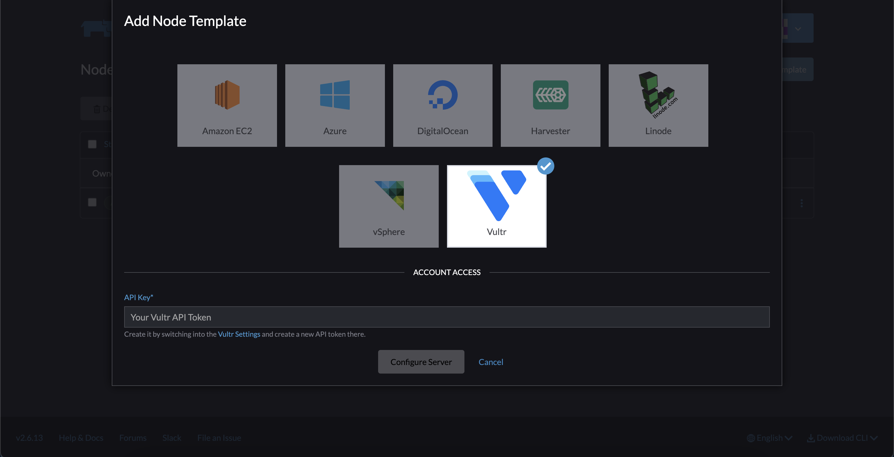
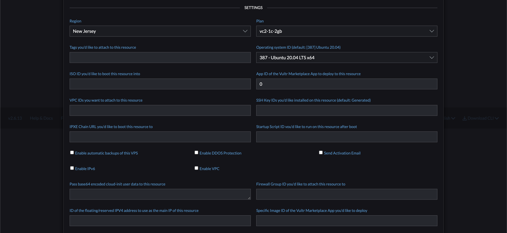

# Rancher Vultr UI Driver

Rancher 2.X UI driver for [Vultr](https://www.vultr.com).

## Usage

* Add a Machine Driver in Rancher 2 (`Cluster Management` -> `Drivers` -> `Node Drivers`)

| Key | Value |
| --- | ----- |
| Download URL | `https://github.com/vultr/docker-machine-driver-vultr/archive/refs/tags/v2.0.0.tar.gz` |
| Custom UI URL | `https://sjc1.vultrobjects.com/rancher-ui/component.js` |
| Whitelist Domains |  `api.vultr.com, sjc1.vultrobjects.com` |

* Wait for the driver to become "Active"
* Go to Clusters -> Add Cluster, your driver and custom UI should show up.

## Compatibility

The following `component.js` is always compatible with the latest Rancher 2.X version:

`https://sjc1.vultrobjects.com/rancher-ui/component.js`

## Development

This package contains a small web-server that will serve up the custom driver UI at `http://localhost:3000/component.js`. You can run this while developing and point the Rancher settings there.
* `npm start`
* The driver name can be optionally overridden: `npm start -- --name=DRIVERNAME`
* The compiled files are viewable at http://localhost:3000.
* **Note:** The development server does not currently automatically restart when files are changed.

## Building

For other users to see your driver, you need to build it and host the output on a server accessible from their browsers.

* `npm run build`
* Copy the contents of the `dist` directory onto a webserver.
  * If your Rancher is configured to use HA or SSL, the server must also be available via HTTPS.

## Useful resources

### `Error creating machine: Error running provisioning: ssh command error:`

Try to use `overlay2` and if it does not work `overlay` as `Storage Driver` in the `Engine Options` in the bottom.